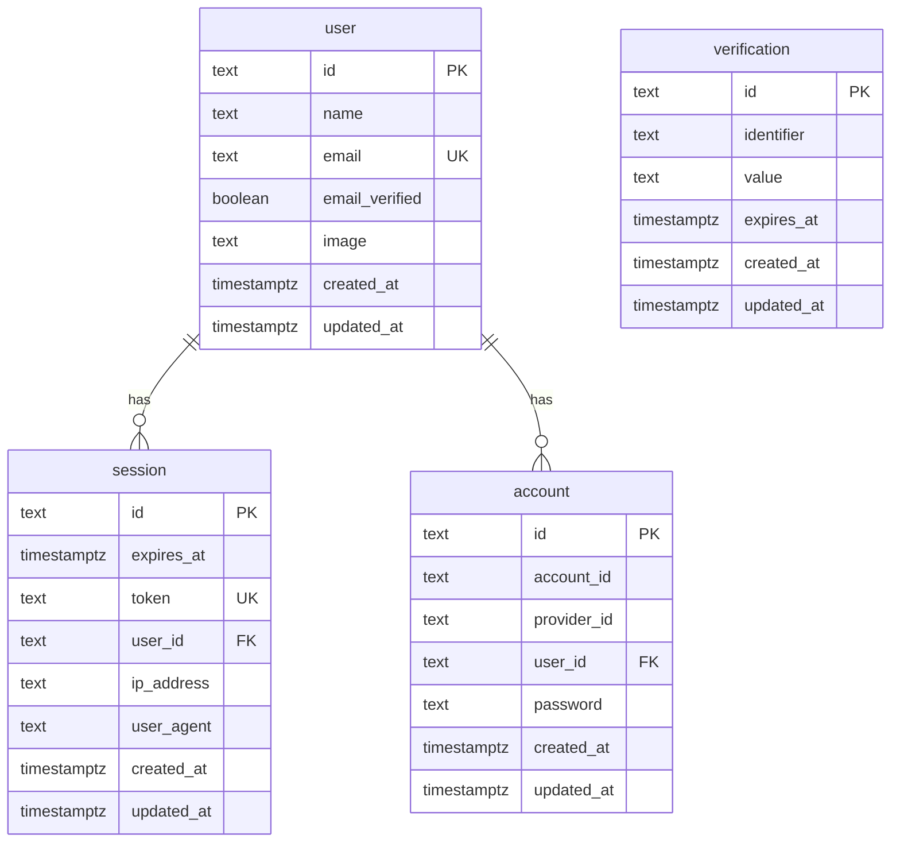

# Database ERD — Focolare

This document mirrors the Drizzle schema in [`src/db/schema.ts`](../src/db/schema.ts).

## Auth (Better Auth)

## Taxonomy

- **taxonomy_category**: hierarchical nodes (`parent_id` self-FK), `slug`, `label`, `sort_order`, `is_active`.
- **taxonomy_suggestion**: user proposals; `status` ∈ `pending | approved | rejected`; optional `parent_category_id`.

## Creators & content

- **media_asset**: `storage_key`, `public_url`, `mime_type`, `kind` ∈ `image | video`.
- **channel**: owned by `user` (`owner_user_id`), optional `avatar_media_id`, future `stripe_connect_account_id`.
- **recipe**: belongs to `channel`; `taxonomy_category_id`; `visibility` ∈ `public | members`; `ingredients` JSONB; unique `(channel_id, slug)`.
- **recipe_step**: ordered steps with `duration_seconds`, `offset_from_previous` (gap after previous step ends), optional `parallel_group_id` (reserved).
- **recipe_media**: M2M `recipe` ↔ `media_asset` with `sort_order`.

## Social

- **comment**, **rating** (unique per user per recipe), **follow** (composite PK user × channel).
- **channel_subscription**: `demo_active` gates member recipes in Phase 1; nullable Stripe columns for Phase 2.
- **collection**, **collection_recipe** (optional saves).

## Cook mode & notifications

- **cook_session**: `state` ∈ `planning | active | paused | completed | cancelled`; `target_ready_at`, `planned_start_at`, `current_step_index`, `scale` (percent, default 100).
- **scheduled_step_event**: server-side fires; `kind` ∈ `timer_end | step_reminder`; `status` ∈ `pending | sent | skipped | failed`; **`idempotency_key` UNIQUE**; `push_payload` JSONB; `fire_at` UTC.
- **push_subscription**: Web Push endpoint + keys per user.

## Visibility enum

`recipe.visibility`: **`public`** (anyone) | **`members`** (requires `channel_subscription.demo_active = true` for that channel, until real billing ships).
